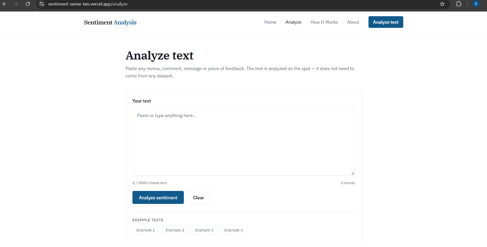
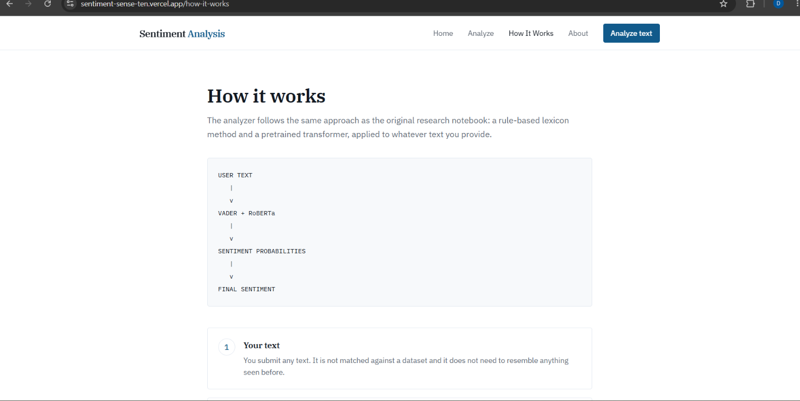

# Sentiment Sense — Sentiment Analysis

Sentiment Sense is an interactive sentiment analysis project that classifies text as **Positive, Neutral, or Negative** using a pretrained **CardiffNLP RoBERTa sentiment model**, with **VADER** providing supporting sentiment analysis.

> Analyze text. Understand sentiment.

## 🚀 Live Demo

[Open Sentiment Sense](https://sentiment-sense-ten.vercel.app/)

## 💻 GitHub

[View Source Code](https://github.com/dheerajmishra75/sentiment-sense)

## 📸 Application Preview

### Home

### Analyze

### How It Works

### About

## 🎯 My Technical Focus

My contribution focused primarily on the **NLP and sentiment analysis workflow**.

The main work includes:

- Text analysis and tokenization
- Pretrained CardiffNLP RoBERTa model inference
- Positive, Neutral, and Negative classification
- Sentiment probability analysis
- Model confidence analysis
- VADER-based supporting sentiment analysis
- Analysis of completely new user-provided text
- Comparison of sentiment signals from RoBERTa and VADER

The application interface is used as the presentation layer for the sentiment analysis results.

## 📌 Overview

Sentiment Sense combines two sentiment analysis approaches:

- **RoBERTa** — Primary transformer-based sentiment classification
- **VADER** — Supporting rule-based sentiment analysis

The application accepts arbitrary user text and processes it directly through the sentiment analysis models.

The runtime application does not require the Amazon Reviews dataset for making predictions.

## ✨ Features

- Analyze completely new text
- Positive, Neutral, and Negative classification
- Pretrained RoBERTa-based sentiment prediction
- Confidence score
- Full probability distribution
- VADER sentiment scores
- Example text inputs
- Recent analysis history
- Clear history functionality
- Loading and validation states
- Browser-based model inference

## 🔄 Sentiment Analysis Pipeline

    User Input
        ↓
    Text Tokenization
        ↓
    CardiffNLP RoBERTa Model
        ↓
    Negative / Neutral / Positive Probabilities
        ↓
    Predicted Sentiment + Confidence

            +

    User Input
        ↓
    VADER Sentiment Analyzer
        ↓
    Positive / Neutral / Negative / Compound Scores
        ↓
    Supporting Sentiment Analysis

## 🤖 Models Used

### CardiffNLP RoBERTa

The primary sentiment classifier uses:

`cardiffnlp/twitter-roberta-base-sentiment`

The model produces probabilities for:

- Negative
- Neutral
- Positive

The highest probability is used as the primary predicted sentiment.

### VADER

VADER is used as a supporting sentiment analyzer through:

`SentimentIntensityAnalyzer()`

It provides:

- Positive score
- Neutral score
- Negative score
- Compound score

Using both approaches provides additional context around the sentiment prediction instead of relying on a single sentiment signal.

## 🧠 How It Works

### 1. Enter Text

The user enters any text they want to analyze.

Example:

`I really enjoyed this product. The quality is excellent.`

### 2. Tokenization

The input text is processed using the tokenizer associated with the CardiffNLP RoBERTa model.

### 3. RoBERTa Prediction

The tokenized input is passed to the pretrained RoBERTa sentiment model.

The model returns probabilities for the three sentiment classes.

### 4. Sentiment Classification

The highest probability determines the primary sentiment:

- Negative
- Neutral
- Positive

### 5. Supporting VADER Analysis

The same text is also analyzed using VADER to provide additional sentiment scores.

### 6. Result

The analysis provides:

- Predicted sentiment
- Confidence
- Positive probability
- Neutral probability
- Negative probability
- VADER sentiment scores

## 📊 Dataset

The project notebook references the **Amazon Reviews dataset (`Reviews.csv`)** for sentiment-analysis experimentation and analysis.

The deployed application does not require the dataset for runtime predictions because sentiment inference is performed using the pretrained sentiment model.

## 📚 Application Pages

- **Home** — Introduces Sentiment Sense and its purpose.
- **Analyze** — Main sentiment analysis interface for entering text, running analysis, viewing probabilities, VADER scores, and recent history.
- **How It Works** — Explains the sentiment analysis workflow and models.
- **About** — Provides project and technology information.

## 🛠️ Technical Skills

- Natural Language Processing
- Machine Learning
- Sentiment Analysis
- Transformers
- CardiffNLP RoBERTa
- VADER
- Hugging Face Transformers
- Text Tokenization
- Probability-based Classification
- Model Inference

## 🔄 Project Workflow

    Text Input
        ↓
    NLP Processing
        ↓
    Transformer Model
        ↓
    Probability Distribution
        ↓
    Sentiment Classification
        ↓
    Supporting VADER Analysis
        ↓
    Interactive Result

## 📌 Project Approach

The project focuses on applying a pretrained NLP model to completely new user-provided text rather than limiting sentiment analysis to predefined dataset records.

The main technical focus is the **NLP and sentiment analysis layer**, while the application interface provides a way to interact with and present the resulting analysis.

## 💡 Example

### Input

`This movie was absolutely amazing. I loved every minute of it.`

### Output

**Sentiment:** Positive

**Confidence:** Model-generated probability

**Probability Distribution:**

- Positive: Model-generated probability
- Neutral: Model-generated probability
- Negative: Model-generated probability

**VADER:**

- Positive: Model-generated score
- Neutral: Model-generated score
- Negative: Model-generated score
- Compound: Model-generated score

The exact probabilities and scores depend on the model's inference for the provided text.

## ⚠️ Limitations

- Sentiment predictions are model-based estimates and should not be treated as absolute judgments.
- Prediction quality depends on the language, context, and type of text provided.
- The pretrained RoBERTa model is not retrained specifically for this project.
- Initial browser-based model loading may take some time.
- VADER provides complementary sentiment scores rather than replacing the primary transformer-based prediction.

## 🚀 Future Improvements

- Multilingual sentiment analysis
- Batch text analysis
- CSV upload for large-scale sentiment analysis
- Sentiment visualization dashboards
- Downloadable analysis reports
- Comparison of additional pretrained transformer models
- Domain-specific sentiment models

## 🔗 Project Links

**GitHub:**  
https://github.com/dheerajmishra75/sentiment-sense

**Live Demo:**  
https://sentiment-sense-ten.vercel.app/

## 👨‍💻 Contribution

My primary contribution focused on the **NLP and sentiment analysis workflow**, including pretrained CardiffNLP RoBERTa inference, sentiment classification, probability analysis, and supporting VADER-based analysis.

The application interface presents the results produced by the underlying sentiment analysis workflow.

## 🚀 Local Development

    git clone https://github.com/dheerajmishra75/sentiment-sense.git
    cd sentiment-sense
    npm install
    npm run dev

Open the local development URL provided by Vite in your browser.

## 👤 Author

**Dheeraj Mishra**

B.Tech Computer Science & Engineering

Interested in Data Science, Data Analytics, Machine Learning, Natural Language Processing, and Artificial Intelligence.

**GitHub:**  
https://github.com/dheerajmishra75

**Live Demo:**  
https://sentiment-sense-ten.vercel.app/

## ⚠️ Disclaimer

Sentiment Sense provides machine-learning-based sentiment estimates for the text provided by the user. Predictions can vary depending on language, context, and model limitations and should not be treated as definitive interpretations of human emotion.
